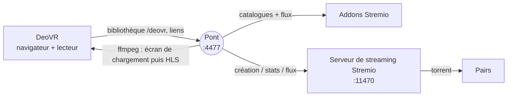

<div align="center">

# Pont DeoVR ⇄ Stremio

**Parcourez votre bibliothèque Stremio depuis DeoVR et lancez un film en un clic.**

[](https://github.com/Slater-proj/deovr-stremio-bridge/actions/workflows/ci.yml)
[](https://github.com/Slater-proj/deovr-stremio-bridge/releases/latest)
[](LICENSE)


[Télécharger](../../releases/latest) · [Installation](docs/INSTALL.md) · [Utilisation](docs/USAGE.md) · [Dépannage](docs/TROUBLESHOOTING.md) · [English](README.md)

</div>

---

Un petit serveur web local entre **DeoVR** (version PC, sur Steam) et **Stremio**. Le navigateur intégré de DeoVR ouvre le pont et affiche une bibliothèque native : onglets, vignettes, indicateurs VR. Le pont lit vos addons Stremio, laisse le serveur de streaming de Stremio télécharger le torrent et fournit à DeoVR un flux qu'il sait lire. Pas de Debrid, pas de service en ligne, aucune dépendance npm : un seul `.exe` portable (Node.js et ffmpeg inclus).

Conçu avec un Pimax Dream Air et une RTX 4090 ; les autres casques PCVR utilisant DeoVR pour Windows devraient fonctionner.

## Fonctionnalités

- **Bibliothèque DeoVR native** : tapez l'adresse du pont dans le navigateur de DeoVR → onglets *En cours*, *Plus de seeds*, *Nouveautés*, un onglet par catalogue Stremio, recherche et onglet de test. Vignettes au format 16:9 comme celles de DeoVR.
- **Aucun téléchargement pendant que vous naviguez.** Le téléchargement démarre au choix du film, continue 30 minutes après avoir quitté le lecteur (réglable), fonctionne pour plusieurs films en parallèle et reprend au lieu de repartir de zéro.
- **Écran de chargement honnête** à chaque clic : étape, pairs, Mo reçus, débit réel/nécessaire, tampon, temps restant, messages clairs (« débit insuffisant », « aucune source »). Il bascule tout seul sur le film quand assez est en mémoire tampon.
- **VR correctement déclarée** : dôme 180°, sphère 360°, fisheye ou MKX200, côte à côte ou dessus-dessous, d'après le catalogue, le genre et le titre (`LR`, `TB`, `OU` compris).
- **Pastilles stables** dans le titre : `[S12] Titre`, `[EN COURS 18 % · 1,4 Mo/s]`, `[PRÊT · 8 min en tampon]`, `[BLOQUÉ · 0 pair]`, identiques dans la liste et la fiche.
- **Pensé pour durer** : ffmpeg est relancé à la bonne position s'il plante, les segments déjà vus sont supprimés quand le disque se remplit, la taille du cache Stremio est contrôlée, un message clair s'affiche si Stremio n'est pas lancé, et `start.bat` (variante Node.js) relance le pont s'il s'arrête.
- **Portable, sans installation** : un seul `DeoVR-Stremio-Bridge.exe` avec Node.js et ffmpeg dans le zip ; tout ce qu'il écrit reste dans un dossier `data\` à côté. Supprimer le dossier supprime tout.
- **Votre mot de passe Stremio n'est jamais enregistré.** Connexion une seule fois sur une page locale (`/setup`, accessible depuis le PC uniquement) ; le pont garde une clé de session chiffrée par Windows (DPAPI).
- **Mode développeur** (`--dev` / `utility\LANCER-MODE-DEV.bat` dans le zip debug) : console détaillée, sortie d'ffmpeg, page `/dev`, et `--report` (`utility\RAPPORT-SUPPORT.bat`) qui écrit un rapport (secrets masqués) avec tout ce qu'il faut pour déboguer.
- **Diagnostic intégré** : `--diagnose`, rapport d'assistance, journaux par clic, bilan par film, `/status`, `/debug/downloads`.

## Comment ça marche



1. DeoVR demande l'adresse du pont ; le pont répond avec la bibliothèque au format JSON de DeoVR.
2. Au clic, le pont demande au serveur de streaming de Stremio de lancer ce torrent et donne à DeoVR un flux HLS.
3. Pendant que les données arrivent, DeoVR lit un écran de chargement généré ; quand le tampon est suffisant, le même flux continue avec le vrai film.

Détails : [docs/ARCHITECTURE.md](docs/ARCHITECTURE.md).

## Prérequis

| | |
|---|---|
| Système | Windows 10/11 x64 (le code tourne aussi sous Linux/macOS, c'est ce que teste surtout la CI) |
| Stremio | application lancée (serveur de streaming sur `127.0.0.1:11470`) avec au moins un addon |
| DeoVR | version PC (Steam) |
| Node.js / ffmpeg | **rien à installer** avec l'exe portable (les deux sont inclus). Le zip « version Node » demande Node 20+ et ffmpeg (`INSTALL.bat` les installe avec winget) |
| Cache Stremio | Paramètres → Streaming → cache **illimité ou ≥ 20 Go** (les films VR sont énormes) |

## Démarrage rapide

1. Téléchargez `DeoVR-Stremio-Bridge-vX.Y.Z-windows-x64.zip` depuis la dernière [Release](../../releases/latest) et décompressez-le où vous voulez (pas dans *Program Files*).
2. Lancez Stremio, puis double-clic sur **`DeoVR-Stremio-Bridge.exe`**. Windows SmartScreen peut avertir (exe non signé) : *Informations complémentaires → Exécuter quand même*.
3. Première fois seulement : le navigateur s'ouvre sur une page de connexion locale — saisissez e-mail et mot de passe Stremio une fois.
4. Dans le navigateur de DeoVR, tapez `http://localhost:4477`.

La fenêtre noire est la console du pont (fermer = arrêter). Les réglages sont dans `config.json`, créé à côté de l'exe au premier lancement (port par défaut **4477**, modifiable là) ; tout ce que le pont écrit (clé chiffrée, journaux, fichiers temporaires) reste dans `data\`. Détails, options et variante Node.js : [docs/INSTALL.md](docs/INSTALL.md).

Deux zips sont publiés : **release** (exe + `resources\` + `docs\`, rien d'autre) et **debug** (le même plus un dossier `utility\` : mode développeur, rapport d'assistance, diagnostic, pare-feu, démarrage automatique ; chaque outil est décrit dans `utility\LISEZMOI-UTILITAIRES.txt`).

## Sécurité de votre compte Stremio

Stremio n'a pas d'OAuth : la seule façon d'obtenir une session est l'e-mail + le mot de passe. Le pont les demande sur une page servie **uniquement au PC lui-même**, les échange contre une clé de session et oublie le mot de passe. La clé est enregistrée dans `data\secrets.dat`, chiffrée avec **Windows DPAPI** (lisible uniquement par votre compte Windows sur ce PC). `--logout` la supprime. Description complète et limites : [SECURITY.md](SECURITY.md).

## Ce qui est vérifié, ce qui ne l'est pas

Les tests automatiques (CI, simulations) couvrent la page de connexion et ses protections (aucun mot de passe sur disque, clé conservée, déconnexion, migration d'un ancien `config.json`), la bibliothèque, la déclaration VR, les pastilles, la recherche, les vignettes, le flux clic → téléchargement → écran de chargement → film, la reprise après plantage de ffmpeg, l'élagage du disque, le budget de cache et le message « Stremio arrêté ». La CI fabrique aussi **le vrai exe sous Windows**, le décompresse dans un dossier neuf et le lance (test de fumée : ffmpeg embarqué, dossier `data`, page de connexion, bibliothèque, bascule écran de chargement → film, rapport).

**Il faut un vrai casque** pour confirmer : la bascule HLS écran de chargement → film : **confirmée au casque pour le H.264** ; les films HEVC demandent « Retour puis relancer » (le HEVC dans un flux HLS TS échoue, en MP4/MKV direct il passe) ; d'autres vérifications au casque dans l'onglet « Test pont » (Labos 1 à 12) ; les liens `deovr://` depuis le navigateur de DeoVR (page `/t`), les champs réels de l'API de Stremio selon sa version, l'affichage des accents, le chiffrement DPAPI sur votre propre PC et le comportement de l'exe face à votre antivirus / SmartScreen. Protocole : [docs/TESTING.md](docs/TESTING.md).

## Builds de test

Chaque push vert sur `main` met à jour la **[pré-release dev-build](../../releases/tag/dev-build)** (exe portable + zip Node.js) : le code le plus récent, qui a passé les tests automatiques et le test de fumée de l'exe mais **n'est pas encore validé sur un vrai casque**. Préférez la [dernière release](../../releases/latest) sauf si vous voulez aider à tester.

## Documentation

[Installation](docs/INSTALL.md) · [Utilisation](docs/USAGE.md) · [Configuration](docs/CONFIGURATION.md) · [Dépannage](docs/TROUBLESHOOTING.md) · [Architecture](docs/ARCHITECTURE.md) · [Points d'accès HTTP](docs/HTTP-ENDPOINTS.md) · [Notes DeoVR](docs/DEOVR-NOTES.md) · [Tests](docs/TESTING.md) · [Contribuer](CONTRIBUTING.md) · [Maintenance](docs/MAINTAINING.md) · [Sécurité](SECURITY.md) · [Historique](CHANGELOG.md)

## Développement

```bash
git clone https://github.com/Slater-proj/deovr-stremio-bridge.git
cd deovr-stremio-bridge
npm test            # tests unitaires + intégration (ffmpeg requis), simulations uniquement
npm run check       # vérification de syntaxe + doc de configuration à jour
npm run build       # fabrique dist/deovr-stremio-bridge-vX.Y.Z.zip (variante Node.js)
npm run build:exe   # Windows : fabrique le zip de l'exe portable (voir docs/MAINTAINING.md)
```

La CI exécute tous les tests sous Windows avec Node 24, fabrique l'exe portable et teste l'exécutable réel ; un job parallèle contrôle le zip Node.js. Pousser un tag `vX.Y.Z` identique à `package.json` fabrique les deux zips et publie une Release GitHub avec la section correspondante du changelog.

## Mentions légales

Outil local : il **n'héberge, n'indexe ni ne distribue aucun contenu** et n'embarque aucun addon ni source. Vous êtes responsable de ce que vous diffusez et du respect des lois et licences qui s'appliquent. Aucun lien avec Stremio, DeoVR ni les auteurs d'addons.

## Licence

[MIT](LICENSE)
