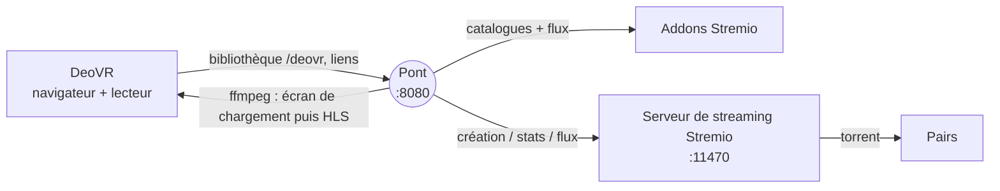

<div align="center">

# Pont DeoVR ⇄ Stremio

**Parcourez votre bibliothèque Stremio depuis DeoVR et lancez un film en un clic.**

[](https://github.com/Slater-proj/deovr-stremio-bridge/actions/workflows/ci.yml)
[](https://github.com/Slater-proj/deovr-stremio-bridge/releases/latest)
[](LICENSE)


[Télécharger](../../releases/latest) · [Installation](docs/INSTALL.md) · [Utilisation](docs/USAGE.md) · [Dépannage](docs/TROUBLESHOOTING.md) · [English](README.md)

</div>

---

Un petit serveur web local entre **DeoVR** (version PC, sur Steam) et **Stremio**. Le navigateur intégré de DeoVR ouvre le pont et affiche une bibliothèque native : onglets, vignettes, indicateurs VR. Le pont lit vos addons Stremio, laisse le serveur de streaming de Stremio télécharger le torrent et fournit à DeoVR un flux qu'il sait lire. Pas de Debrid, pas de service en ligne, aucune dépendance npm : uniquement Node.js et ffmpeg.

Conçu avec un Pimax Dream Air et une RTX 4090 ; les autres casques PCVR utilisant DeoVR pour Windows devraient fonctionner.

## Fonctionnalités

- **Bibliothèque DeoVR native** : tapez l'adresse du pont dans le navigateur de DeoVR → onglets *En cours*, *Plus de seeds*, *Nouveautés*, un onglet par catalogue Stremio, recherche et onglet de test. Vignettes au format 16:9 comme celles de DeoVR.
- **Aucun téléchargement pendant que vous naviguez.** Le téléchargement démarre au choix du film, continue 30 minutes après avoir quitté le lecteur (réglable), fonctionne pour plusieurs films en parallèle et reprend au lieu de repartir de zéro.
- **Écran de chargement honnête** à chaque clic : étape, pairs, Mo reçus, débit réel/nécessaire, tampon, temps restant, messages clairs (« débit insuffisant », « aucune source »). Il bascule tout seul sur le film quand assez est en mémoire tampon.
- **VR correctement déclarée** : dôme 180°, sphère 360°, fisheye ou MKX200, côte à côte ou dessus-dessous, d'après le catalogue, le genre et le titre (`LR`, `TB`, `OU` compris).
- **Pastilles stables** dans le titre : `[S12] Titre`, `[EN COURS 18 % · 1,4 Mo/s]`, `[PRÊT · 8 min en tampon]`, `[BLOQUÉ · 0 pair]`, identiques dans la liste et la fiche.
- **Pensé pour durer** : ffmpeg est relancé à la bonne position s'il plante, les segments déjà vus sont supprimés quand le disque se remplit, la taille du cache Stremio est contrôlée, un message clair s'affiche si Stremio n'est pas lancé, et `start.bat` relance le pont s'il s'arrête.
- **Diagnostic intégré** : `diagnose.bat`, `RAPPORT.bat` (rapport d'assistance sans secrets), journaux par clic, bilan par film, `/status`, `/debug/downloads`.

## Comment ça marche



1. DeoVR demande l'adresse du pont ; le pont répond avec la bibliothèque au format JSON de DeoVR.
2. Au clic, le pont demande au serveur de streaming de Stremio de lancer ce torrent et donne à DeoVR un flux HLS.
3. Pendant que les données arrivent, DeoVR lit un écran de chargement généré ; quand le tampon est suffisant, le même flux continue avec le vrai film.

Détails : [docs/ARCHITECTURE.md](docs/ARCHITECTURE.md).

## Prérequis

| | |
|---|---|
| Système | Windows 10/11 (le code tourne aussi sous Linux/macOS, c'est ce que teste la CI) |
| Stremio | application lancée (serveur de streaming sur `127.0.0.1:11470`) avec au moins un addon |
| DeoVR | version PC (Steam) |
| Node.js | 20 ou plus, installé par `INSTALL.bat` (winget) |
| ffmpeg | recommandé, installé par `INSTALL.bat` ; nécessaire pour le MKV, l'écran de chargement et les vignettes |
| Cache Stremio | Paramètres → Streaming → cache **illimité ou ≥ 20 Go** (les films VR sont énormes) |

## Démarrage rapide

1. Téléchargez le zip de la dernière [Release](../../releases/latest) et décompressez-le où vous voulez.
2. Double-clic sur `INSTALL.bat` : il installe Node/ffmpeg si besoin et demande votre e-mail et mot de passe Stremio. Ils sont enregistrés dans `config.json`, qui reste sur votre PC.
3. Lancez Stremio, puis double-clic sur `start.bat`.
4. Dans le navigateur de DeoVR, tapez `http://localhost:8080` (ou le port de votre `config.json`).

Facultatif : `DEMARRAGE-AUTO.bat` lance le pont avec Windows ; `PARE-FEU.bat` ouvre le pare-feu pour y accéder depuis un autre appareil.

## Ce qui est vérifié, ce qui ne l'est pas

Les tests automatiques (CI, simulations) couvrent la bibliothèque, la déclaration VR, les pastilles, la recherche, les vignettes, le flux clic → téléchargement → écran de chargement → film, la reprise après plantage de ffmpeg, l'élagage du disque, le budget de cache et le message « Stremio arrêté ».

**Il faut un vrai casque** pour confirmer : la bascule HLS écran de chargement → film dans DeoVR (tests 5 et 6 de l'onglet « Test pont »), les liens `deovr://` depuis le navigateur de DeoVR (page `/t`), les champs réels de l'API de Stremio selon sa version, l'affichage des accents. Protocole : [docs/TESTING.md](docs/TESTING.md).

## Documentation

[Installation](docs/INSTALL.md) · [Utilisation](docs/USAGE.md) · [Configuration](docs/CONFIGURATION.md) · [Dépannage](docs/TROUBLESHOOTING.md) · [Architecture](docs/ARCHITECTURE.md) · [Points d'accès HTTP](docs/HTTP-ENDPOINTS.md) · [Notes DeoVR](docs/DEOVR-NOTES.md) · [Tests](docs/TESTING.md) · [Contribuer](CONTRIBUTING.md) · [Sécurité](SECURITY.md) · [Historique](CHANGELOG.md)

## Développement

```bash
git clone https://github.com/Slater-proj/deovr-stremio-bridge.git
cd deovr-stremio-bridge
npm test            # tests unitaires + intégration (ffmpeg requis), simulations uniquement
npm run check       # vérification de syntaxe + doc de configuration à jour
npm run build       # fabrique dist/deovr-stremio-bridge-vX.Y.Z.zip
```

La CI tourne sous Ubuntu et Windows avec Node 20, 22 et 24. Pousser un tag `vX.Y.Z` identique à `package.json` fabrique le zip et publie une Release GitHub avec la section correspondante du changelog.

## Mentions légales

Outil local : il **n'héberge, n'indexe ni ne distribue aucun contenu** et n'embarque aucun addon ni source. Vous êtes responsable de ce que vous diffusez et du respect des lois et licences qui s'appliquent. Aucun lien avec Stremio, DeoVR ni les auteurs d'addons.

## Licence

[MIT](LICENSE)
