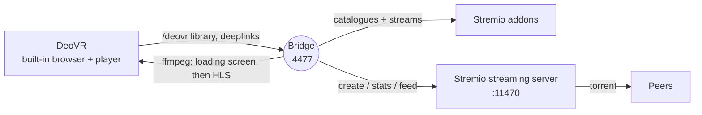

<div align="center">

# DeoVR ⇄ Stremio Bridge

**Browse your Stremio library from inside DeoVR — and start a film with one click.**

[](https://github.com/Slater-proj/deovr-stremio-bridge/actions/workflows/ci.yml)
[](https://github.com/Slater-proj/deovr-stremio-bridge/releases/latest)
[](LICENSE)


[Download](../../releases/latest) · [Install](docs/INSTALL.md) · [Usage](docs/USAGE.md) · [Troubleshooting](docs/TROUBLESHOOTING.md) · [Français](README.fr.md)

</div>

---

A tiny local web server that sits between **DeoVR** (PC version, on Steam) and **Stremio**. DeoVR's built-in browser opens the bridge and shows a native library — tabs, thumbnails, VR flags. The bridge reads your Stremio addons, lets Stremio's own streaming server download the torrent, and feeds DeoVR a stream it can play. No Debrid account, no cloud service, no npm dependency: a single portable `.exe` (Node.js and ffmpeg included).

Designed on a Pimax Dream Air + RTX 4090; any PCVR headset running DeoVR for Windows should work.

> The application itself (console, loading screen, DeoVR lists) is currently in **French**, and so are the guides in `docs/`. Translations are welcome — see [CONTRIBUTING.md](CONTRIBUTING.md).

## Features

- **Native DeoVR library** — type the bridge address in DeoVR's browser and get tabs: *En cours* (what you started), *Plus de seeds*, *Nouveautés*, one tab per Stremio catalogue, search, and a test tab. Thumbnails are 16:9 like DeoVR's own.
- **Nothing downloads while you browse.** The download starts when you pick a film, continues for 30 minutes after you leave the player (configurable), runs for several films at once and resumes instead of restarting from zero.
- **Honest loading screen** at every click: step, peers, MB received, real vs needed speed, buffer, ETA, and plain messages such as "not enough speed" or "no source". It switches to the film by itself once enough is buffered.
- **You choose the mode for every video.** By default DeoVR's own FLAT / 180° / 360° / fisheye / SBS menu is always available (your choice is remembered per video; the picture is raw side-by-side until you pick). Prefer a correct picture straight away? `"formatMenu": "auto"` declares the format when the title says it (180°, 360°, fisheye or MKX200, side-by-side or top-bottom; `LR`, `TB`, `OU` included) — DeoVR then hides its menu.
- **Local tab**: drop videos downloaded elsewhere into the `videos` folder next to the exe; they appear in DeoVR's *Local* tab and play in full.
- **Preview mode** (`"sampleMode": true`): instead of downloading a whole film, fetch only a few excerpts (start, middle, end — count and length configurable) to get a quick preview of a film that would take hours.
- **Seeking into a part not downloaded yet** no longer freezes the player: after 5 s the bridge answers an error and preloads that zone, so a second try works (DeoVR has no way to show the downloaded ranges; `/status.json` lists them).
- **Stable status badges** in titles: `[S12] Title`, `[EN COURS 18 % · 1,4 Mo/s]`, `[PRÊT · 8 min en tampon]`, `[BLOQUÉ · 0 pair]` — identical in the list and the film page.
- **Built to keep running**: ffmpeg is restarted at the right position if it crashes, watched segments are trimmed when the disk gets full, the Stremio cache size is checked, a clear message appears if Stremio isn't running, and `start.bat` (Node.js variant) restarts the bridge if it stops.
- **Portable, no installation**: one `DeoVR-Stremio-Bridge.exe` with Node.js and ffmpeg inside the zip; everything it writes stays in a `data\` folder next to it. Delete the folder and it is gone.
- **Your Stremio password is never stored.** You sign in once on a local page (`/setup`, reachable from the PC only); the bridge keeps a session key encrypted with Windows DPAPI.
- **Troubleshooting made easy**: `bridge-events.log` summarises a session (player requests, seeks, DeoVR relaunches with memory and disk at that moment, disk alerts) and comes first in the support report.
- **Developer mode** (`--dev` / `utility\LANCER-MODE-DEV.bat` in the debug zip): detailed console log, ffmpeg output, a `/dev` page, and `--report` (`utility\RAPPORT-SUPPORT.bat`) which writes a support report (secrets masked) with everything needed to debug.
- **Diagnostics included**: `--diagnose`, a support report, per-click logs, a per-film summary, `/status` and `/debug/downloads`.

## How it works



1. DeoVR requests the bridge's address; the bridge answers with the library in DeoVR's JSON format.
2. On a click, the bridge asks Stremio's streaming server to start that torrent and hands DeoVR an HLS stream.
3. While data accumulates, DeoVR plays a generated loading screen; when the buffer is long enough, the same stream continues with the real film.

More detail in [docs/ARCHITECTURE.md](docs/ARCHITECTURE.md).

## Requirements

| | |
|---|---|
| OS | Windows 10/11 x64 (the code also runs on Linux/macOS, that is what most of CI covers) |
| Stremio | desktop app running (streaming server on `127.0.0.1:11470`) with at least one addon |
| DeoVR | PC version (Steam) |
| Node.js / ffmpeg | **nothing to install** with the portable exe (both included). The advanced Node.js zip needs Node 20+ and ffmpeg (`INSTALL.bat` installs them with winget) |
| Stremio cache | Settings → Streaming → cache **unlimited or ≥ 20 GB** (VR films are huge) |

## Quick start

1. Download `DeoVR-Stremio-Bridge-vX.Y.Z-windows-x64.zip` from [Releases](../../releases/latest) and unzip it anywhere (not in *Program Files*).
2. Start Stremio, then double-click **`DeoVR-Stremio-Bridge.exe`**. Windows SmartScreen may warn because the exe is not code-signed: *More info → Run anyway*.
3. First run only: your browser opens a local sign-in page — enter your Stremio e-mail and password once.
4. In DeoVR's browser, type `http://localhost:4477`.

The console window is the bridge's log; closing it stops the bridge. Settings live in `config.json` created beside the exe on first run (the default port is **4477**; change it there); everything the bridge writes (encrypted key, logs, temp files) lives in `data\`. Details, options and the advanced Node.js variant: [docs/INSTALL.md](docs/INSTALL.md).

Two zips are published: **release** (exe + `resources\` + `docs\` — nothing else) and **debug** (the same plus a `utility\` folder: developer mode, support report, diagnostics, firewall, autostart; each tool is described in `utility\LISEZMOI-UTILITAIRES.txt`).

## Security of your Stremio account

Stremio has no OAuth, so the only way to get a session is e-mail + password. The bridge asks for them on a page served **only to the PC itself**, exchanges them for a session key, and forgets the password. The key is stored in `data\secrets.dat`, encrypted with **Windows DPAPI** (readable only by your Windows account on this PC). `--logout` deletes it. Full description and limits: [SECURITY.md](SECURITY.md).

## What is verified, and what is not

| Covered by automated tests (CI, with mocks) | Still needs a real headset to be confirmed |
|---|---|
| library tabs and order, VR declaration, badges, search, 16:9 thumbnails | H.264 loading-screen → film HLS switch is confirmed on a headset; HEVC films need "back, then relaunch" (HEVC inside HLS-TS fails; direct MP4/MKV HEVC works) — more headset checks in the *Labo 1–16* tab |
| click ⇒ download, loading screen ⇒ film, "En cours" tab | `deovr://` links start a NEW DeoVR instance in desktop mode (measured) — use them from the PC browser only; the seek guard (503 + preload), preview mode and the *Local* tab are new in 10.3 and not yet confirmed on a headset |
| ffmpeg crash recovery, disk trimming, cache budget, Stremio-down message | real field names of Stremio's `/settings` and `stats.json` on every Stremio version |
| films with 0 seeders never produce a fake film | accents and `·` rendering in DeoVR titles |
| sign-in page and its protections, no password on disk, key persistence, log-out, legacy `config.json` migration | — |
| the **real exe**, built on Windows in CI, started in a clean folder (smoke test: bundled ffmpeg, data folder, sign-in page, library, loading-screen switch, report) | DPAPI encryption on your own PC and exe behaviour on your antivirus / SmartScreen |

The real-device test protocol and how to send a useful report are in [docs/TESTING.md](docs/TESTING.md).

## Test builds

Every green push to `main` refreshes the **[dev-build pre-release](../../releases/tag/dev-build)** (the two portable-exe zips, release and debug): the very latest code, passed the automated tests and the exe smoke test but **not yet validated on a real headset**. Prefer the [latest release](../../releases/latest) unless you want to help test.

## Documentation

| Guide | |
|---|---|
| [Install](docs/INSTALL.md) | portable exe (recommended) or Node.js variant |
| [Usage](docs/USAGE.md) | tabs, badges, the loading screen, search |
| [Configuration](docs/CONFIGURATION.md) | every `config.json` option (generated from the code) |
| [Troubleshooting](docs/TROUBLESHOOTING.md) | symptoms → causes → fixes |
| [Architecture](docs/ARCHITECTURE.md) · [HTTP endpoints](docs/HTTP-ENDPOINTS.md) · [DeoVR notes](docs/DEOVR-NOTES.md) | how it is built and what DeoVR accepts |
| [Testing](docs/TESTING.md) · [Maintaining](docs/MAINTAINING.md) · [Contributing](CONTRIBUTING.md) · [Security](SECURITY.md) · [Changelog](CHANGELOG.md) | for contributors |

## Development

```bash
git clone https://github.com/Slater-proj/deovr-stremio-bridge.git
cd deovr-stremio-bridge
npm test            # unit + integration tests (needs ffmpeg), mocks only, no real Stremio
npm run check       # syntax check + configuration doc up to date
npm run build       # builds dist/deovr-stremio-bridge-vX.Y.Z.zip (Node.js variant)
npm run build:exe   # Windows: builds the portable exe zip (see docs/MAINTAINING.md)
```

CI runs the full test suite on Windows with Node 24, builds the portable exe and smoke-tests the real executable; a parallel job checks the Node.js zip. Pushing a tag `vX.Y.Z` that matches `package.json` builds both zips and publishes a GitHub Release with the matching section of the changelog.

## Legal

This project is a local tool. It **does not host, index or distribute any content** and ships no addon or source. You are responsible for what you stream and for respecting the laws and licences that apply to you. It is not affiliated with Stremio, DeoVR or any addon author.

## License

[MIT](LICENSE)
